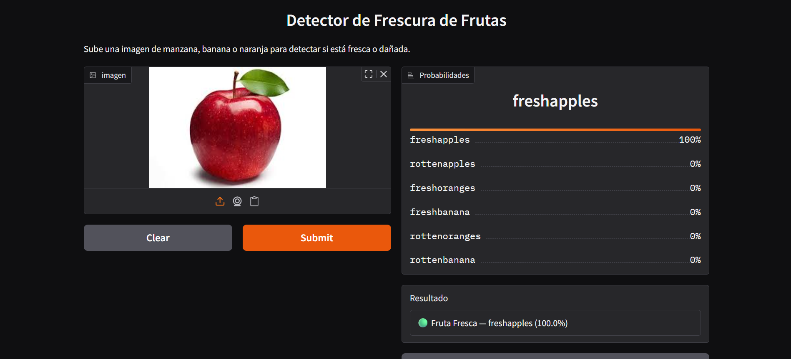
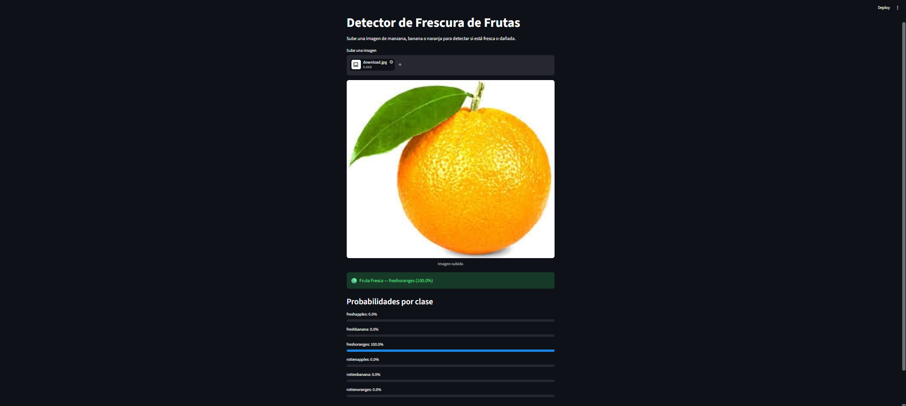

# 🍎 Fruit Freshness Detector

Detector de frescura de frutas usando Deep Learning con MobileNetV2 y mapas de calor Grad-CAM.

**[Demo en vivo en Hugging Face Spaces](https://huggingface.co/spaces/ImzSebas/fruit-freshness-detector)**

---

## Descripción

Este proyecto clasifica imágenes de manzanas, bananas y naranjas como **frescas o dañadas** usando Transfer Learning con MobileNetV2. Incluye visualización con Grad-CAM para mostrar las zonas que el modelo analiza para tomar su decisión.

---

## Dataset

- **Fuente:** [Fruits Fresh and Rotten for Classification](https://www.kaggle.com/datasets/sriramr/fruits-fresh-and-rotten-for-classification) — Kaggle
- **Imágenes:** 13,599 imágenes
- **Clases:** freshapples, freshbanana, freshoranges, rottenapples, rottenbanana, rottenoranges
- **División:** Train / Test lista para usar

---

## Modelos

| Métrica | CNN Baseline | MobileNetV2 |
|---|---|---|
| Test Accuracy | 97% | 99% |
| F1-score macro | 0.97 | 0.99 |
| Épocas | 10 | 10 |
| Tamaño | ~15MB | ~11.5MB |

---

## Capturas de la app

### Gradio


### Streamlit


---

## ⚙️ Instalación local

```bash
git clone https://github.com/imzsebas/fruit-freshness-detector.git
cd fruit-freshness-detector
pip install -r requirements.txt
```

### Ejecutar Gradio
```bash
python app_gradio.py
```

### Ejecutar Streamlit
```bash
streamlit run app_streamlit.py
```

---

## Grad-CAM

El proyecto implementa Grad-CAM (Gradient-weighted Class Activation Mapping) para visualizar las zonas que el modelo considera más relevantes al tomar su decisión de clasificación.

---

## Limitaciones

- Solo clasifica manzanas, bananas y naranjas
- No funciona bien con iluminación muy baja
- La fruta debe estar centrada en la imagen

---

## Tecnologías

- Python 3.11
- TensorFlow / Keras
- MobileNetV2 (Transfer Learning)
- Gradio
- Streamlit
- tf-keras-vis (Grad-CAM)
- Google Colab

---

## Proyecto académico

Aprendizaje Computacional — Ingeniería de Sistemas  
Prof. Oswaldo Velez Lang, PhD

Presentado por : 
Sebastian Nuñez Berrio
Eduardo Mercado pinto
Jaider Muskus Sibaja